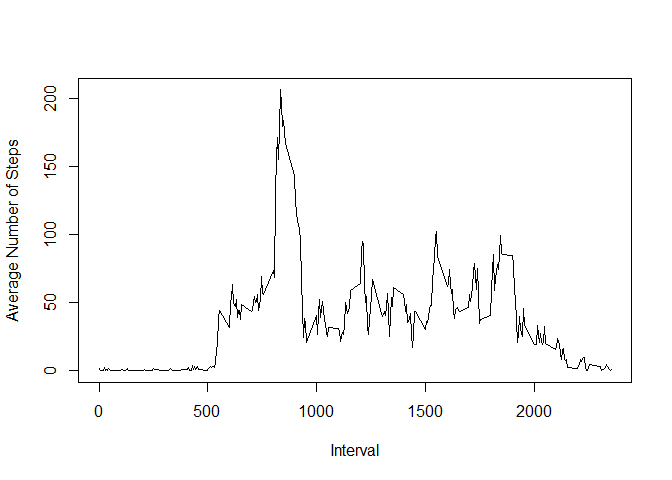

# Reproducible Research: Peer Assessment 1

##Introduction

It is now possible to collect a large amount of data about personal movement using activity monitoring devices such as a Fitbit, Nike Fuelband, or Jawbone Up. These type of devices are part of the "quantified self" movement - a group of enthusiasts who take measurements about themselves regularly to improve their health, to find patterns in their behavior, or because they are tech geeks. But these data remain under-utilized both because the raw data are hard to obtain and there is a lack of statistical methods and software for processing and interpreting the data.

This assignment makes use of data from a personal activity monitoring device. This device collects data at 5 minute intervals through out the day. The data consists of two months of data from an anonymous individual collected during the months of October and November, 2012 and include the number of steps taken in 5 minute intervals each day.

##Data

The data for this assignment can be downloaded from the course web site:

* Dataset: [Activity monitoring data](https://d396qusza40orc.cloudfront.net/repdata%2Fdata%2Factivity.zip) [52K]

The variables included in this dataset are:

* steps: Number of steps taking in a 5-minute interval (missing values are coded as NA)

* date: The date on which the measurement was taken in YYYY-MM-DD format

* interval: Identifier for the 5-minute interval in which measurement was taken

The dataset is stored in a comma-separated-value (CSV) file and there are a total of 17,568 observations in this dataset.


##Assignment

This assignment will be described in multiple parts. You will need to write a report that answers the questions detailed below. Ultimately, you will need to complete the entire assignment in a **single R markdown** document that can be processed by **knitr** and be transformed into an HTML file.

Throughout your report make sure you always include the code that you used to generate the output you present. When writing code chunks in the R markdown document, always use `echo = TRUE` so that someone else will be able to read the code. **This assignment will be evaluated via peer assessment so it is essential that your peer evaluators be able to review the code for your analysis.**

For the plotting aspects of this assignment, feel free to use any plotting system in R (i.e., base, lattice, ggplot2)

Fork/clone the [GitHub repository created for this assignment](http://github.com/rdpeng/RepData_PeerAssessment1). You will submit this assignment by pushing your completed files into your forked repository on GitHub. The assignment submission will consist of the URL to your GitHub repository and the SHA-1 commit ID for your repository state.

NOTE: The GitHub repository also contains the dataset for the assignment so you do not have to download the data separately.

## Loading and preprocessing the data

We assume that the reader set the correct R working directory with the setwd() function.

1. Load the data (i.e. `read.csv()`)


```r
# Clear the workspace
rm(list=ls())

#Load the activity data
activity <- read.csv("activity.csv", stringsAsFactors=FALSE)
```

2. Process/transform the data (if necessary) into a format suitable for analysis


```r
#Transform the date attribute to an actual date format
activity$date <- as.POSIXct(activity$date, format="%Y-%m-%d")

#Compute weekdays from the date attribute
activity <- data.frame(date=activity$date, 
                       weekday=tolower(weekdays(activity$date)), 
                        steps=activity$steps, 
                        interval=activity$interval)

#Compute the day type (weekday or weekend)
activity <- cbind(activity, daytype=ifelse(activity$weekday=="saturday" | activity$weekday=="sunday", "weekend", "weekday"))

#create the final data.frame
activity_data <- data.frame(date=activity$date,
                            weekday=activity$weekday,
                            daytype=activity$daytype,
                            interval=activity$interval,
                            steps=activity$steps)

#Clear the workspace
rm(activity)
```

Displaying the first few rows and summary of the `activity_data` data frame.


```r
head(activity_data)
```

```
##         date weekday daytype interval steps
## 1 2012-10-01  monday weekday        0    NA
## 2 2012-10-01  monday weekday        5    NA
## 3 2012-10-01  monday weekday       10    NA
## 4 2012-10-01  monday weekday       15    NA
## 5 2012-10-01  monday weekday       20    NA
## 6 2012-10-01  monday weekday       25    NA
```


```r
summary(activity_data)
```

```
##       date                 weekday        daytype         interval     
##  Min.   :2012-10-01   friday   :2592   weekday:12960   Min.   :   0.0  
##  1st Qu.:2012-10-16   monday   :2592   weekend: 4608   1st Qu.: 588.8  
##  Median :2012-10-31   saturday :2304                   Median :1177.5  
##  Mean   :2012-10-31   sunday   :2304                   Mean   :1177.5  
##  3rd Qu.:2012-11-15   thursday :2592                   3rd Qu.:1766.2  
##  Max.   :2012-11-30   tuesday  :2592                   Max.   :2355.0  
##                       wednesday:2592                                   
##      steps       
##  Min.   :  0.00  
##  1st Qu.:  0.00  
##  Median :  0.00  
##  Mean   : 37.38  
##  3rd Qu.: 12.00  
##  Max.   :806.00  
##  NA's   :2304
```

## What is mean total number of steps taken per day?

1. Histogram of total number of steps taken each day


```r
library(plyr)
library(dplyr)
```

```
## 
## Attaching package: 'dplyr'
## 
## The following objects are masked from 'package:plyr':
## 
##     arrange, count, desc, failwith, id, mutate, rename, summarise,
##     summarize
## 
## The following objects are masked from 'package:stats':
## 
##     filter, lag
## 
## The following objects are masked from 'package:base':
## 
##     intersect, setdiff, setequal, union
```

```r
#loading library for ggplot
library(ggplot2)

#Calculating total steps taken each day
total_steps <- aggregate(activity_data$steps, by=list(activity_data$date), FUN=sum, na.rm=TRUE)

#Rename the attributes
names(total_steps) <- c("date", "steps")

#Print the first few rows
head(total_steps)
```

```
##         date steps
## 1 2012-10-01     0
## 2 2012-10-02   126
## 3 2012-10-03 11352
## 4 2012-10-04 12116
## 5 2012-10-05 13294
## 6 2012-10-06 15420
```

```r
#Create graph using ggplot2
ggplot(total_steps, aes(x=date, y=steps))+geom_histogram(stat="identity")+ xlab("Dates")+ ylab("Steps")+ labs(title= "Total numbers of Steps per day")
```

 


2. Mean and Median of the total number of steps taken per day


```r
#Calculating Mean
mean(total_steps$steps)
```

```
## [1] 9354.23
```


```r
#Calculating Median
median(total_steps$steps)
```

```
## [1] 10395
```

## What is the average daily activity pattern?

1. Average daily pattern


```r
#Calculate average daily activity pattern
daily <- activity_data %>%
        filter(!is.na(steps)) %>%
        group_by(interval) %>%
        summarize(steps=mean(steps)) %>%
        print
```

```
## Source: local data frame [288 x 2]
## 
##    interval     steps
## 1         0 1.7169811
## 2         5 0.3396226
## 3        10 0.1320755
## 4        15 0.1509434
## 5        20 0.0754717
## 6        25 2.0943396
## 7        30 0.5283019
## 8        35 0.8679245
## 9        40 0.0000000
## 10       45 1.4716981
## ..      ...       ...
```

Make a time series plot (i.e. type = "l") of the 5-minute interval (x-axis) and the average number of steps taken, averaged across all days (y-axis)


```r
plot(daily, type = "l", xlab="Interval", ylab="Average Number of Steps")
```

 

2. Which 5-minute interval, on average across all the days in the dataset, contains the maximum number of steps?


```r
daily[which.max(daily$steps), ]$interval
```

```
## [1] 835
```

## Imputing missing values

1. Calculate and report the total number of missing values in the dataset (i.e. the total number of rows with NA's)


```r
#Clearing the workspace
rm(daily)

#counting number of NA's
Total_NA <- sum(is.na(activity_data$steps))
```
Number of NA's is **2304**.

2. Create a new dataset that is equal to the original dataset but with the missing data filled in. Mean of steps is used to replace the NAs.


```r
na_pos <- which(is.na(activity_data$steps))

# Create a vector of means
mean_vec <- rep(mean(activity_data$steps, na.rm=TRUE), times=length(na_pos))

# Replace the NAs by the means
activity_data[na_pos, "steps"] <- mean_vec

# Clear the workspace
rm(mean_vec, na_pos)

head(activity_data)
```

```
##         date weekday daytype interval   steps
## 1 2012-10-01  monday weekday        0 37.3826
## 2 2012-10-01  monday weekday        5 37.3826
## 3 2012-10-01  monday weekday       10 37.3826
## 4 2012-10-01  monday weekday       15 37.3826
## 5 2012-10-01  monday weekday       20 37.3826
## 6 2012-10-01  monday weekday       25 37.3826
```


3. Make a histogram of the total number of steps taken each day and Calculate and report the mean and median total number of steps taken per day.


```r
# Compute the total number of steps each day (NA values removed)
new_steps<- aggregate(activity_data$steps, by=list(activity_data$date), FUN=sum)

# Rename the attributes
names(new_steps) <- c("date", "steps")

#Create the histogram
ggplot(new_steps, aes(x=date, y=steps))+geom_histogram(stat="identity")+ xlab("Dates")+ ylab("Imputed Steps")+ labs(title= "Total numbers of Steps per day (missing data imputed)")
```

 

Calculate and report the mean and median total number of steps taken per day. 


```r
#Calculating mean and median
mean(new_steps$steps)
```

```
## [1] 10766.19
```

```r
median(new_steps$steps)
```

```
## [1] 10766.19
```

Do these values differ from the estimates from the first part of the assignment?

```r
mean(total_steps$steps) == mean(new_steps$steps)
```

```
## [1] FALSE
```

```r
median(total_steps$steps) == median(new_steps$steps)
```

```
## [1] FALSE
```

```r
summary(total_steps)
```

```
##       date                steps      
##  Min.   :2012-10-01   Min.   :    0  
##  1st Qu.:2012-10-16   1st Qu.: 6778  
##  Median :2012-10-31   Median :10395  
##  Mean   :2012-10-31   Mean   : 9354  
##  3rd Qu.:2012-11-15   3rd Qu.:12811  
##  Max.   :2012-11-30   Max.   :21194
```

```r
summary(new_steps)
```

```
##       date                steps      
##  Min.   :2012-10-01   Min.   :   41  
##  1st Qu.:2012-10-16   1st Qu.: 9819  
##  Median :2012-10-31   Median :10766  
##  Mean   :2012-10-31   Mean   :10766  
##  3rd Qu.:2012-11-15   3rd Qu.:12811  
##  Max.   :2012-11-30   Max.   :21194
```

The impact of imputing missing data on the estimates of the total daily number of steps is shown in the summary below:


```r
#The differences between the imputed missing data and the original data
summary(new_steps$steps) - summary(total_steps$steps)
```

```
##    Min. 1st Qu.  Median    Mean 3rd Qu.    Max. 
##      41    3041     370    1416       0       0
```

These values shows that there is great differences between the two set of values


## Are there differences in activity patterns between weekdays and weekends?
1. Create a new factor variable in the dataset with two levels - "weekdays" and "weekend" indicating whether a given date is a weekday or weekend day.


```r
#The factor variable was created earlier and already in the data frame
head(activity_data)
```

```
##         date weekday daytype interval   steps
## 1 2012-10-01  monday weekday        0 37.3826
## 2 2012-10-01  monday weekday        5 37.3826
## 3 2012-10-01  monday weekday       10 37.3826
## 4 2012-10-01  monday weekday       15 37.3826
## 5 2012-10-01  monday weekday       20 37.3826
## 6 2012-10-01  monday weekday       25 37.3826
```


2. Make a panel plot containing a time series plot (i.e. type = "l") of the 5- minute interval (x-axis) and the average number of steps taken, averaged across all weekday days or weekend days (y-axis).


```r
# Load the lattice graphical library
library(lattice)

# Compute the average number of steps taken, averaged across all daytype variable
mean_data <- aggregate(activity_data$steps, 
                       by=list(activity_data$daytype, 
                               activity_data$weekday, activity_data$interval), mean)

# Rename the attributes
names(mean_data) <- c("daytype", "weekday", "interval", "mean")
head(mean_data)
```

```
##   daytype  weekday interval     mean
## 1 weekday   friday        0 8.307244
## 2 weekday   monday        0 9.418355
## 3 weekend saturday        0 4.672825
## 4 weekend   sunday        0 4.672825
## 5 weekday thursday        0 9.375844
## 6 weekday  tuesday        0 0.000000
```

```r
#Plot the graph
xyplot(mean ~ interval | daytype, mean_data, 
       type="l", 
       lwd=1, 
       xlab="Interval", 
       ylab="Number of steps", 
       layout=c(1,2))
```

 
